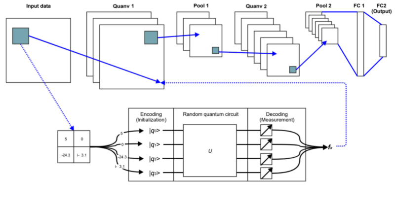

# Quanvolutional Neural Networks (QCNNs)

Hi There! 👋 
This is a repo where you have access to my Jupiter Notebook, along with some resources that made it all possible! 

## Table of Contents
* [What are QCNNs?](##What-are-QCNNs?)
* [Acknowledgements](##Acknowledgements)
* [Connect with me](##Connect-with-me)

## What are QCNNs?

A Quanvolutional Neural Network (QNN) are basically a CNN but with quanvolutional layers (much like how CNN's have convolutioanl layers). A Quanvolutional layer acts and behaves just like a convolutional layer! 

 
Credit: https://arxiv.org/abs/1904.04767

Much like a normal convolutional layer, we take a subset of the image, pass it through our kernal, and then it outputs something that'll be part of a new image. 

Since it acts so much like a normal Convolutional layer, you could literally use both a QNN and a CNN together in the same model!

### A Longer Explanation:

For a longer explanation - check out my blog about QCNNs! I go super into the details: [Article!](https://dickson-wu.medium.com/quantum-eyes-1ae995e78a40)

## Acknowledgements

* [Excellent Paper of an overview of QCNNs](https://arxiv.org/abs/2009.09423)
* [Excellent Paper of an deep dive of QCNNs](https://arxiv.org/abs/1904.04767)
* [Code Help](https://github.com/Menborong/Simple-QCNN/blob/master/Simple_QCNN_MNIST.ipynb)
* [Code Help](ttps://www.kaggle.com/lys620/opencv-eda-and-classification)
* [Dataset](https://www.kaggle.com/c/plant-pathology-2021-fgvc8/overview)
* [Other Cool Reso](https://www.tensorflow.org/quantum/tutorials/qcnn#11_assemble_circuits_in_a_tensorflow_graph)
* [Other Cool Reso](https://arxiv.org/pdf/2102.06535v1.pdf)
* [Other Cool Reso](https://arxiv.org/abs/1810.03787)

## Connect with me

If you want to follow along on my journey, you can join my [monthly newsletter](https://www.subscribepage.com/g1p8w4), check out my [website](https://dicksonwu654.github.io/), and connect on [Linkedin](https://www.linkedin.com/in/real-dickson-wu/) or [Twitter](https://twitter.com/DicksonWu3) 😃
